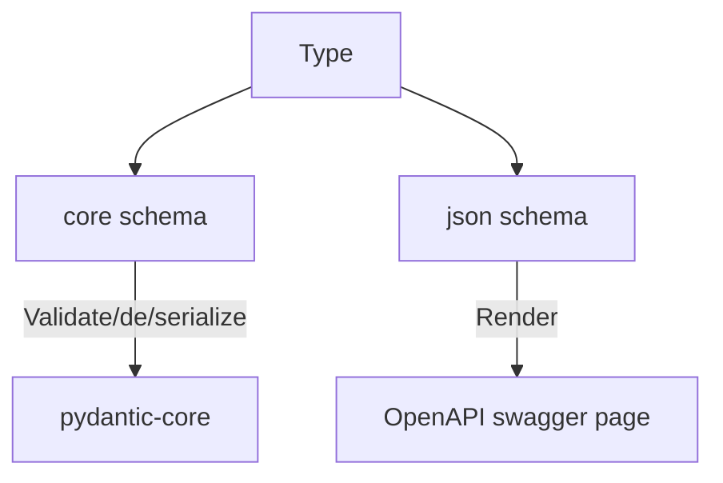
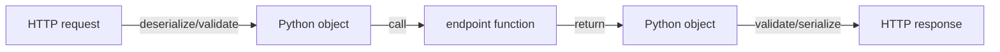
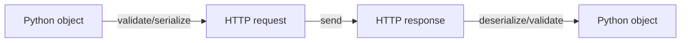

# 利用 Pydantic 提升 Python 代码的开发体验

**Frost Ming**

<tabler-brand-github /> frostming

:: note ::

<div class="fw-200" >

PyCon China 2024, 上海

</div>

<!--
The last comment block of each slide will be treated as slide notes. It will be visible and editable in Presenter Mode along with the slide. [Read more in the docs](https://sli.dev/guide/syntax.html#notes)
-->

<style>
  .cover {
    background-color: #009cdf;
    background-image:
        linear-gradient(to right,
            rgba(0, 156, 223, 0) 0%,
            rgba(0, 156, 223, 0) 20%,
            rgba(0, 156, 223, 1) 40%,
            rgba(0, 156, 223, 1) 100%
        ),
        linear-gradient(45deg, #00b7eb 25%, transparent 25%),
        linear-gradient(-45deg, #00b7eb 25%, transparent 25%),
        linear-gradient(45deg, transparent 75%, #00b7eb 75%),
        linear-gradient(-45deg, transparent 75%, #00b7eb 75%);
    background-size: 100% 100%, 40px 40px, 40px 40px, 40px 40px, 40px 40px;
    background-position: 0 0, 0 0, 0 20px, 20px -20px, -20px 0px;
    background-repeat: no-repeat, repeat, repeat, repeat, repeat;
  }
</style>

---
layout: image-right
image: './images/bentoml.png'
---

# About Myself

- 💻 **目前就职于：** - [BentoML](https://bentoml.com)
- 🐍 **Python 开源：**
  - [PyPA 成员](https://github.com/pypa)
  - [PDM](https://pdm-project.org) 作者
- 🏅 **Microsoft Python MVP**
- 🎤 **PyCon China：** - 自从 2017 年
- 演示文稿： https://slides.fming.dev/pydantic/

<QRCode value="https://slides.fming.dev/pydantic/" :size="120" render-as="svg"/>

---
layout: section
color: slate
---

# Pydantic 的用法

---
layout: top-title-two-cols
align: l-lt-lt
color: slate
---

:: title ::

# Pydantic 的基础用法

<div class="text-2xl mb-4"><strong>Pydantic</strong> - <em>Data validation using Python type hints</em></div>

[](https://pypi.python.org/pypi/pydantic)
[](https://pepy.tech/project/pydantic)

:: left ::

## 定义

```python
from pydantic import BaseModel

class User(BaseModel):
    id: int
    name: str
    age: int
```

:: right ::

## 使用

```python
>>> user = User(id=1, name='Frost', age=30)
>>> print(user)
User(id=1, name='Frost', age=30)
>>> print(user.model_dump())
{'id': 1, 'name': 'Frost', 'age': 30}
>>> print(user.model_dump_json())
{"id":1,"name":"Frost","age":30}
```

---
layout: top-title
color: slate
---

:: title ::

# Pydantic 的进阶用法——Annotations

:: content ::

````md magic-move {lines: true}
```python
from pydantic import BaseModel

class User(BaseModel):
    id: int
    name: str
    age: int = 18
```

```python {*|5-7|*}
# v1 风格
from pydantic import BaseModel, Field

class User(BaseModel):
    id: int = Field(gt=0)
    name: str = Field(max_length=32)
    age: int = Field(18, gt=0)
```

```python {*|3,4|7-9|*}
# v2 风格
from pydantic import BaseModel
from typing import Annotated
from annotated_types import Gt, MaxLen

class User(BaseModel):
    id: Annotated[int, Gt(0)]
    name: Annotated[str, MaxLen(32)]
    age: Annotated[int, Gt(0)] = 18
```
````

<div v-click>

校验

```python
>>> user = User(id=-1, name='Frost', age=30)
Traceback (most recent call last):
  File "<stdin>", line 1, in <module>
  File "/Users/fming/wkspace/.venv/lib/python3.11/site-packages/pydantic/main.py", line 193, in __init__
    self.__pydantic_validator__.validate_python(data, self_instance=self)
pydantic_core._pydantic_core.ValidationError: 1 validation error for User
id
  Input should be greater than 0 [type=greater_than, input_value=-1, input_type=int]
    For further information visit https://errors.pydantic.dev/2.8/v/greater_than
```

</div>

---
layout: side-title
color: slate
align: rm-lm
---

:: title ::

# Pydantic 的进阶用法——自定义类型

:: content ::

```python
from pydantic import BaseModel

class Pet:
    def __init__(self, name: str):
        self.name = name

class MyModel(BaseModel, arbitrary_types_allowed=True):
    dog: Pet

model = MyModel(dog=Pet(name='Fido'))
```

<div v-click>

不支持序列化

```python
>>> model.model_dump_json()
PydanticSerializationError: Unable to serialize unknown type: <class '__main__.Pet'>
```

</div>

---
layout: top-title
color: slate
---

:: title ::

# Pydantic 进阶用法——自定义类型

:: content ::

```python {*|2-9|11-17}{lines: true}
class EmailStr
    @classmethod
    def __get_pydantic_core_schema__(
        cls,
        _source: type[Any],
        _handler: GetCoreSchemaHandler,
    ) -> core_schema.CoreSchema:
        import_email_validator()
        return core_schema.no_info_after_validator_function(cls._validate, core_schema.str_schema())

    @classmethod
    def __get_pydantic_json_schema__(
        cls, core_schema: core_schema.CoreSchema, handler: _schema_generation_shared.GetJsonSchemaHandler
    ) -> JsonSchemaValue:
        field_schema = handler(core_schema)
        field_schema.update(type='string', format='email')
        return field_schema

    @classmethod
    def _validate(cls, input_value: str, /) -> str:
        return validate_email(input_value)[1]
```

---
layout: side-title
color: slate
align: rm-lm
---

:: title ::
# Pydantic 进阶用法——自定义类型

:: content ::



---
layout: top-title-two-cols
align: l-lt-lt
color: slate
---

:: title ::

# Pydantic 进阶用法——自定义类型

:: left ::

```python
TruncatedFloat = Annotated[
    float,
    AfterValidator(lambda x: round(x, 1)),
    PlainSerializer(lambda x: f'{x:.1e}', return_type=str),
    WithJsonSchema({'type': 'string'}, mode='serialization'),
]
```

<AdmonitionType type='note' >
方法的实现可以分布在多个 Annotation 中
</AdmonitionType>

:: right ::

```python
class AfterValidator:
    def __get_pydantic_core_schema__(
        self,
        _source: type[Any],
        _handler: GetCoreSchemaHandler,
    ) -> core_schema.CoreSchema:
        ...

class PlainSerializer:
    def __get_pydantic_core_schema__(
        self,
        _source: type[Any],
        _handler: GetCoreSchemaHandler,
    ) -> core_schema.CoreSchema:
        ...

class WithJsonSchema:
    def __get_pydantic_json_schema__(
        self, core_schema: core_schema.CoreSchema, handler: GetJsonSchemaHandler
    ) -> JsonSchemaValue:
        ...
```

---
layout: top-title-two-cols
color: slate
align: l-lt-lt
---

:: title ::
# 例：在 BaseModel 中支持 numpy array

:: left ::

````md magic-move {lines: true}
```python
class InputData(BaseModel):
    data: np.ndarray
```

```python {*|20,23}
from pydantic_core import core_schema

class InputData(BaseModel):
    data: np.ndarray

@dataclass
class TensorSchema:
    shape: Optional[Tuple[int, ...]] = None

    def __get_pydantic_json_schema__(self, schema, handler):
        dimension = 1 if self.shape is None else len(self.shape)
        child = {"type": "number"}
        for _ in range(dimension):
            child = {"type": "array", "items": child}
        value.update(child)
        return value

    def __get_pydantic_core_schema__(self, source_type, handler):
        return core_schema.no_info_after_validator_function(
            self.validate,
            core_schema.any_schema(),
            serialization=core_schema.plain_serializer_function_ser_schema(
                self.encode
            ),
        )
```

```python {4}
from pydantic_core import core_schema

class InputData(BaseModel):
    data: Annontated[np.ndarray, TensorSchema(shape=(10,))]

@dataclass
class TensorSchema:
    shape: Optional[Tuple[int, ...]] = None

    def __get_pydantic_json_schema__(self, schema, handler):
        dimension = 1 if self.shape is None else len(self.shape)
        child = {"type": "number"}
        for _ in range(dimension):
            child = {"type": "array", "items": child}
        value.update(child)
        return value

    def __get_pydantic_core_schema__(self, source_type, handler):
        return core_schema.no_info_after_validator_function(
            self.validate,
            core_schema.any_schema(),
            serialization=core_schema.plain_serializer_function_ser_schema(
                self.encode
            ),
        )

    def encode(self, arr):
        return arr.tolist()
```
````

:: right ::

<div v-click>

```python
class TensorSchema:
    ...

    def validate(self, obj):
        return np.asarray(obj)

    def encode(self, arr):
        return arr.tolist()

```
</div>

---
layout: section
color: slate
---

# 使用 Pydantic 实现开发者友好的 Web API

---
layout: top-title-two-cols
color: slate
align: l-lt-lt
---

:: title ::

# Web API Schema 的两种风格

:: left ::

## 装饰器

```python
class Input:
    text: str
    number: int

@api.post("/", input=Input)
def endpoint(input):
    ...
```

<SpeechBubble position="t" color="teal" shape="round" maxWidth="300px" textAlign="center">
需要写类型注解吗？
</SpeechBubble>

<div v-click>

## 类型注解

```python
@api.post("/")
def endpoint(input: Input):
    ...
```

</div>

:: right ::

<div v-click>

## 第三种方案？

- Machine Learning Serving
- POST only
- input 通常是一组输入参数的集合

```python
@api("/")
def endpoint(text: str, number: int) -> str:
    ...
```

<SpeechBubble position="t" color="teal" shape="round" maxWidth="200px" textAlign="center">

**特化！**

</SpeechBubble>

</div>

---
layout: top-title
color: slate
---

:: title ::

# 开发者体验：Web API

:: content ::

期待的 API：
```python
@api("/")
def endpoint(text: str, number: int) -> str:
    ...
```

请求：

```bash
curl -XPOST http://localhost:3000/ \
    -H 'Content-Type: application/json' \
    -d '{"text": "hello", "number": 42}'
```

响应：
```
42 is the answer to the ultimate question of life
```

<div v-click>



</div>

---
layout: top-title-two-cols
color: slate
align: l-lt-lt
---

:: title ::

# 从类型注解生成 Pydantic Model

:: left ::

```python {*|6-12|14}{lines: true}
def get_input_model(func):
    fields = {}
    signature = inspect.signature(func)

    for name, param in signature.parameters.items():
        annotation = param.annotation
        if annotation is param.empty:
            annotation = t.Any
        default = param.default
        if default is param.empty:
            default = Field()
        fields[name] = (annotation, default)

    return pydantic.create_model("Input", **fields)
```

:: right ::

```python {*|7-13}{lines: true}
def get_output_model(func):
    return_annotation = inspect.signature(func)\
        .return_annotation
    if return_annotation is inspect.Signature.empty:
        return_annotation = t.Any

    if issubclass(return_annotation, pydantic.BaseModel):
        output_model = return_annotation
    else:
        output_model = pydantic.create_model(
            "Output",
            __base__=pydantic.RootModel[return_annotation],
        )
    return output_model
```

---
layout: top-title
color: slate
---

:: title ::

# 解析请求和生成响应

:: content ::

```python
def parse_request(request, model):
    return model.model_validate_json(request.read())

def call_api(api, model_instance):
    parameters = {k: getattr(model_instance, k) for k in model_instance.__class__.model_fields}
    return api.endpoint(**parameters)

def make_response(model_instance):
    return JSONResponse(content=model_instance.model_dump_json())
```

---
layout: side-title
color: slate
align: rm-lm
---

:: title ::

# 处理特殊类型

:: content ::

````md magic-move {lines: true}
```python
@api()
def classify(input: NumpyArray) -> int:
    return int(iris_model.predict(input)[0][0])
```

```python {*|6}
# @api()
# def classify(input: NumpyArray) -> int:
#     return int(iris_model.predict(input)[0][0])

@api()
def classify(input: np.ndarray) -> int:
    return int(iris_model.predict(input)[0][0])
```
````
<div v-click>

- 不希望用户手动更换类型注解
- 用直觉的方式标注类型
- 减少迁移的心智负担

</div>

---
layout: top-title
color: slate
---

:: title ::

# 处理特殊类型

:: content ::

```python {*|4|*}{lines: true}
from pydantic import GenerateSchema
from typing import get_origin

class FriendlyGenerateSchema(GenerateSchema):
    def _get_prepare_pydantic_annotations_for_known_type(
        self, obj, annotations
    ):
        res = super()._get_prepare_pydantic_annotations_for_known_type(obj, annotations)
        if res is not None:
            return res

        origin = get_origin(obj)
        if origin is np.ndarray:
            return obj, [TensorSchema()]  # TODO: 提取 shape
```

更换 Schema Generator：

```python
return pydantic.create_model(
    "Input",
    __cls_kwargs__={'schema_generator': FriendlyGenerateSchema},
    **fields
)
```

---
layout: side-title
color: slate
align: rm-lm
---

:: title ::

# JSON 之外

:: content ::

```python
def txt2image(text: str) -> Path:
    return pipeline.generate_image(text)

def ocr(image: Path) -> str:
    return pipeline.recognize_text(image)
```

<div v-click>

Python 类型与传输格式

</div>

---
layout: top-title
color: slate
---

:: title ::

# Multipart Form: HTTP 混合二进制的请求格式

:: content ::

```bash {*|5,9}{lines: true}
POST /upload HTTP/1.1
Content-Type: multipart/form-data; boundary=----WebKitFormBoundary7MA4YWxkTrZu0gW

------WebKitFormBoundary7MA4YWxkTrZu0gW
Content-Disposition: form-data; name="images"
...

------WebKitFormBoundary7MA4YWxkTrZu0gW
Content-Disposition: form-data; name="images"; content-type="image/png"
...

------WebKitFormBoundary7MA4YWxkTrZu0gW
Content-Disposition: form-data; name="text"
...
```

<div v-click class="flex gap-4">
<div class="flex-1">

Web API:

```python
@api("/upload")
def upload(images: list[Path], text: str) -> str:
    ...
```

</div>
<div class="flex-1">

CURL:

```bash
curl -XPOST http://localhost:3000/upload \
    -F 'images=@/path/to/image1.png' \
    -F 'images=@/path/to/image2.png' \
    -F 'text="hello"'
```

</div>
</div>

---
layout: top-title
color: slate
---

:: title ::
# HTTP 请求和响应

:: content ::

```python {*|6-9|11}{lines: true}
async def parse_request(request, model):
    if request.headers["Content-Type"].startswith("multipart/form-data"):
        collected = {}
        form = await request.form()
        for key, value in form.items():
            if isinstance(value, UploadFile):
                with open(os.path.join("uploads", value.filename), "wb") as f:
                    f.write(await value.read())
                collected[key] = Path(f.name)
            else:
                collected[key] = json.loads(value)
        return model.model_validate(collected)
    return parse_json_request(request, model)

async def make_response(model_instance):
    if isinstance(model_instance, Path):
        return FileResponse(model_instance)
    return JSONResponse(content=model_instance.model_dump_json())
```

---
layout: side-title
color: slate
align: rm-lm
---

:: title ::
# 支持的类型

:: content ::

- JSON 类型(Pydantic 内置)
- `pathlib.Path`
- 张量类型：`np.ndarray`/`torch.Tensor`/`tf.Tensor`
- `PIL.Image.Image`

---
layout: image-right
image: ./images/webui.png
---

# Bonus: 生成 Web UI

```
UI = render(model.schema())
```

---
layout: side-title
color: slate
align: rm-lt
---

:: title ::

# Bonus: Python Client

:: content ::


Service 代码

```python
class IrisService:
    @api()
    def classify(input: np.ndarray) -> int:
        return int(iris_model.predict(input)[0][0])
```

Client 代码

```python
client = Client.from_service(IrisService)
result = client.classify([[1, 2, 3, 4]])
assert result == 0
```

<SpeechBubble position="t" color="teal" shape="round" maxWidth="300px" textAlign="center">
自动补全和类型提示可用！
</SpeechBubble>

---
layout: side-title
color: sky
align: rm-lm
---

:: title ::

# Q&A

:: content ::

<div class="flex">
<div class="flex-1">

BentoML
<tabler-brand-github /> [bentoml/BentoML](https://github.com/bentoml/BentoML)
<QRCode value="https://github.com/bentoml/BentoML" :size="150" render-as="svg"/>

演示文稿
<QRCode value="https://slides.fming.dev/pydantic/" :size="150" render-as="svg"/>

</div>
<div class="flex-1">

Frost Ming
<tabler-brand-github /> [frostming](https://github.com/frostming)
<QRCode value="https://github.com/frostming" :size="150" render-as="svg"/>

友好的 Python
<QRCode value="https://frostming.com/tag/friendly%20python/" :size="150" render-as="svg"/>

</div>
</div>
