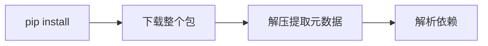
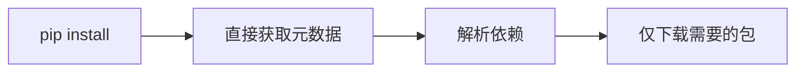

# Python Packaging PEPs

<div class="text-2xl text-gray-500 mt-2">
打包生态系统的最新进展
</div>

<div class="pt-12">
  <span @click="$slidev.nav.next" class="px-2 py-1 rounded cursor-pointer" hover="bg-white bg-opacity-10">
    开始 <carbon:arrow-right class="inline"/>
  </span>
</div>

<!--
这个演讲将介绍 Python 打包生态系统的最新 PEP 提案进展，包括已经完成、已接受和正在讨论的提案。
-->

---
layout: intro
class: pl-20
---

# 关于我

<div class="my-10 grid grid-cols-[120px,1fr] gap-8">
  <div>
    
  </div>
  <div>
    <div class="text-3xl font-bold">Frost Ming</div>
    <div class="text-xl text-gray-500 mt-2">Python Developer · PyPA Member</div>
    <div class="mt-4">
      <div>🛠️ PDM 作者 - 现代 Python 包管理器</div>
      <div>📦 Python 打包生态贡献者</div>
      <div>✨ 开源项目：Unearth, Marko, Monas</div>
    </div>
    <div class="mt-4 flex gap-4 text-sm">
      <a href="https://github.com/frostming" target="_blank" class="text-blue-500">
        <carbon:logo-github class="inline mr-1"/> @frostming
      </a>
      <a href="https://frostming.com" target="_blank" class="text-blue-500">
        <carbon:blog class="inline mr-1"/> frostming.com
      </a>
      <a href="https://mas.to/@frostming" target="_blank" class="text-blue-500">
        <carbon:logo-mastodon class="inline mr-1"/> mas.to@frostming
      </a>
    </div>
  </div>
</div>

---
transition: fade-out
---

# 什么是 PEP？

<div class="grid grid-cols-2 gap-8 mt-8">
<div>

### Python Enhancement Proposal

- Python 改进提案
- 描述新特性或流程的技术规范
- 社区驱动的决策过程
- 推动 Python 生态系统演进

</div>
<div>

### 打包相关的 PEP

- 定义打包标准和规范
- 改进依赖管理
- 提升用户体验
- 促进工具互操作性

</div>
</div>

---
layout: section
---

# 已完成的 PEP
## Final Status

---

# PEP 723：内联脚本元数据

<div class="mt-6">

```python {all|1-8|10-12}
# /// script
# requires-python = ">=3.11"
# dependencies = [
#   "requests",
#   "rich",
# ]
# ///

import requests
from rich import print

print(requests.get("https://api.github.com"))
```

### 主要特性

- 在单文件脚本中声明依赖
- 标准化的元数据格式
- 工具可以自动处理依赖安装

</div>

<!--
PEP 723 允许在 Python 脚本文件中直接声明依赖关系，非常适合单文件脚本和快速原型开发。
-->

---

# PEP 735：依赖组

<div class="mt-6">

```toml {all|2-4|6-8|10-13}
[dependency-groups]
test = [
  "pytest>=7.0",
  "pytest-cov",
]
docs = [
  "sphinx>=5.0",
  "sphinx-rtd-theme",
]
dev = [
  { include-group = "test" },
  { include-group = "docs" },
  "pre-commit",
]
```

### 优势

- 标准化的依赖分组方式
- 支持组合和继承
- 替代各种工具特定的格式

</div>

<!--
PEP 735 在 pyproject.toml 中定义了标准的依赖组格式，统一了不同工具的依赖管理方式。
-->

---

# PEP 751：锁文件格式

<div class="mt-4">

```toml {all|1-5|7-13}
[[packages]]
name = "requests"
version = "2.31.0"
source = { registry = "https://pypi.org/simple" }
sdist = { url = "...", hash = "sha256:..." }

[[packages.wheels]]
url = "..."
hash = "sha256:..."
tags = ["cp39-cp39-manylinux_2_17_x86_64"]
requires-python = ">=3.7"
dependencies = ["certifi", "charset-normalizer", "idna", "urllib3"]
```

### 特点

- 记录精确的依赖版本
- 包含完整的哈希值
- 支持跨平台锁定
- 确保可重现的安装

</div>

<!--
PEP 751 定义了一个标准的锁文件格式，用于记录精确的依赖版本，确保在不同环境中的可重现安装。
-->

---
layout: section
---

# 已接受的 PEP
## Accepted Status

---

# PEP 658：简单 API 中的元数据

<div class="mt-6">

### 改进前


### 改进后


<div class="mt-4 text-green-600">

✅ 减少下载量
✅ 加快依赖解析速度
✅ 改善用户体验

</div>

</div>

<!--
PEP 658 允许包索引直接提供包的元数据，无需下载整个包文件，大大提升了依赖解析的效率。
-->

---

# PEP 691：JSON 格式的简单 API

<div class="grid grid-cols-2 gap-6 mt-6">
<div>

### HTML 格式（旧）
```html
<a href="django-4.2.tar.gz">
  django-4.2.tar.gz
</a>
<a href="django-4.2-py3-none-any.whl">
  django-4.2-py3-none-any.whl
</a>
```

</div>
<div>

### JSON 格式（新）
```json
{
  "files": [{
    "filename": "django-4.2.tar.gz",
    "url": "...",
    "hashes": {"sha256": "..."},
    "requires-python": ">=3.8",
    "yanked": false
  }]
}
```

</div>
</div>

<div class="mt-6 text-center">

**更结构化** · **更易解析** · **更多元数据**

</div>

<!--
PEP 691 为 PyPI 简单 API 添加了 JSON 格式支持，使工具能够更容易地解析包信息。
-->

---
layout: section
---

# 讨论中的 PEP
## Under Discussion

---

# PEP 771：默认额外依赖

<div class="mt-6">

```toml {all|2-5|7-9|11}
[project.optional-dependencies]
dev = [
  "pytest",
  "black",
  "mypy",
]
docs = [
  "sphinx",
  "sphinx-rtd-theme",
]
default = ["dev", "docs"]  # 默认安装的额外依赖
```

### 使用场景

```bash
# 安装包及其默认额外依赖
pip install mypackage

# 仅安装核心依赖
pip install mypackage --only-required
```

</div>

<!--
PEP 771 提议添加默认额外依赖的概念，让包维护者能够指定推荐安装的可选依赖。
-->

---

# PEP 794：导入名元数据

<div class="mt-6">

### 问题：包名 ≠ 导入名

<div class="grid grid-cols-3 gap-4 mt-4">
<div class="text-center">

**包名**
`beautifulsoup4`

**导入名**
`bs4`

</div>
<div class="text-center">

**包名**
`pillow`

**导入名**
`PIL`

</div>
<div class="text-center">

**包名**
`python-dateutil`

**导入名**
`dateutil`

</div>
</div>

### 解决方案

```toml
[project]
name = "beautifulsoup4"
import-names = ["bs4"]
```

<div class="mt-4 text-blue-600">

💡 工具可以自动检测未安装的依赖
💡 改善开发体验

</div>

</div>

<!--
PEP 794 解决了包名和导入名不一致的问题，让工具能够更智能地处理依赖关系。
-->

---
layout: section
---

# 总结与展望

---
layout: center
class: text-center
---

# 打包生态的未来

<div class="mt-8 text-left max-w-2xl mx-auto">

### 🎯 标准化是关键
- 统一的规范减少碎片化
- 改善工具之间的互操作性

### 🚀 用户体验优先
- 更快的依赖解析
- 更可靠的环境复现
- 更智能的工具支持

### 🤝 社区驱动
- 积极参与 PEP 讨论
- 提供反馈和使用案例
- 共同塑造 Python 的未来

</div>

---
layout: center
class: text-center
---

# 谢谢！

<div class="text-xl text-gray-500 mt-4">
问题与讨论
</div>

<div class="mt-8">

### 相关链接

[PEPs 官网](https://peps.python.org) · [Python Packaging User Guide](https://packaging.python.org) · [PyPA 讨论区](https://discuss.python.org/c/packaging/14)

</div>
