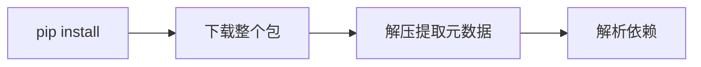
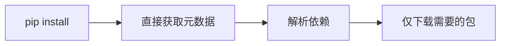

<div class="absolute top-10">
  <span class="font-700">
    Frost Ming @ PyCon China 2025
  </span>
</div>

<div class="absolute bottom-10">
  <h1>Python Packaging PEPs</h1>
  <p>打包生态的最新进展</p>
</div>

<!--
这个演讲将介绍 Python 打包生态系统的最新 PEP 提案进展，包括已经完成、已接受和正在讨论的提案。
-->

<style>
  /* Global styles for light purple theme consistency */
  :root {
    --primary-purple: #7c3aed;
    --dark-purple: #6d28d9;
    --light-purple: #ddd6fe;
    --purple-50: #faf5ff;
    --purple-100: #f3e8ff;
    --purple-600: #7c3aed;
    --purple-700: #6d28d9;
    --purple-900: #4c1d95;
  }

  .slidev-layout {
    background: transparent;
  }

  h1 {
    color: #1a1a1a !important;
    font-weight: 700;
  }

  h2 {
    color: var(--primary-purple) !important;
  }

  h3 {
    color: var(--dark-purple) !important;
  }

  .slidev-code {
    background: rgba(124, 58, 237, 0.05) !important;
    border: 1px solid rgba(124, 58, 237, 0.2);
  }

  table {
    background: var(--purple-50);
    border-radius: 8px;
    overflow: hidden;
    border: 1px solid var(--light-purple);
  }

  table th {
    background: linear-gradient(135deg, var(--primary-purple) 0%, var(--dark-purple) 100%);
    color: white;
    padding: 12px;
    font-weight: 600;
  }

  table td {
    padding: 10px;
    border-bottom: 1px solid var(--light-purple);
    color: #1a1a1a;
  }

  code {
    background: var(--purple-100) !important;
    color: var(--dark-purple) !important;
    padding: 2px 6px;
    border-radius: 4px;
  }

  pre code {
    background: transparent !important;
    color: inherit !important;
  }

  .mermaid {
    background: transparent !important;
  }

  a {
    color: var(--primary-purple) !important;
  }

  a:hover {
    color: var(--dark-purple) !important;
  }
</style>

---
layout: intro
class: pl-20
background: /background.png
---

# 关于我

<div class="my-10 grid grid-cols-[120px,1fr] gap-8">
  <div>
    
  </div>
  <div>
    <div class="text-3xl font-bold text-purple-900">Frost Ming</div>
    <div class="text-xl text-purple-600 mt-2">Python Developer · PyPA Member</div>
    <div class="mt-4">
      <div>🛠️ PDM 作者 - 现代 Python 包管理器</div>
      <div>📦 Python 打包生态贡献者</div>
      <div>✨ 开源项目：Unearth, Marko, Monas</div>
    </div>
    <div class="mt-4 flex gap-4 text-sm">
      <a href="https://github.com/frostming" target="_blank" class="text-purple-600 hover:text-purple-800 transition-colors">
        <carbon:logo-github class="inline mr-1"/> @frostming
      </a>
      <a href="https://frostming.com" target="_blank" class="text-purple-600 hover:text-purple-800 transition-colors">
        <carbon:blog class="inline mr-1"/> frostming.com
      </a>
      <a href="https://mas.to/@frostming" target="_blank" class="text-purple-600 hover:text-purple-800 transition-colors">
        <carbon:logo-mastodon class="inline mr-1"/> mas.to@frostming
      </a>
    </div>
  </div>
</div>

---
transition: fade-out
background: /background.png
---

# 什么是 PEP？

<div class="grid grid-cols-2 gap-8 mt-8">
<div>

### Python Enhancement Proposal

- Python 改进提案
- 描述新特性或流程的技术规范
- 社区驱动的决策过程
- 推动 Python 生态系统演进

</div>
<div>

### 打包相关的 PEP

- 定义打包标准和规范
- 改进依赖管理
- 提升用户体验
- 促进工具互操作性

</div>
</div>

---
layout: section
background: /background.png
---

# 已完成的 PEP
## Final Status

<style>
  .slidev-layout.section h1 {
    color: #1a1a1a;
  }
  .slidev-layout.section h2 {
    color: #7c3aed;
  }
</style>

---

# PEP 723：内联脚本元数据

<div class="mt-6">

```python {all|1-8|10-12}
# /// script
# requires-python = ">=3.11"
# dependencies = [
#   "requests",
#   "rich",
# ]
# ///

import requests
from rich import print

print(requests.get("https://api.github.com"))
```

### 主要特性

- 在单文件脚本中声明依赖
- 标准化的元数据格式
- 工具可以自动处理依赖安装

</div>

<!--
PEP 723 允许在 Python 脚本文件中直接声明依赖关系，非常适合单文件脚本和快速原型开发。
-->

---

# PEP 723：运行脚本

<div class="mt-6">

### 使用现代工具直接运行

```bash
# 使用 PDM - 自动安装依赖并运行
pdm run script.py

# 使用 uv - 自动安装依赖并运行
uv run script.py
```

### 特点

- 🚀 自动检测并安装脚本中声明的依赖
- 📦 创建隔离的虚拟环境
- ✨ 无需手动管理依赖
- 🔄 支持依赖版本锁定和更新

</div>

<!--
PDM 和 uv 等现代工具可以自动解析 PEP 723 格式的内联元数据，创建虚拟环境并安装依赖，让单文件脚本的运行变得非常简单。
-->

---

# PEP 735：依赖组

<div class="mt-6">

```toml {all|2-4|6-8|10-13}
[dependency-groups]
test = [
  "pytest>=7.0",
  "pytest-cov",
]
docs = [
  "sphinx>=5.0",
  "sphinx-rtd-theme",
]
dev = [
  { include-group = "test" },
  { include-group = "docs" },
  "pre-commit",
]
```

### 优势

- 标准化的依赖分组方式
- 支持组合和继承
- 替代各种工具特定的格式

</div>

<!--
PEP 735 在 pyproject.toml 中定义了标准的依赖组格式，统一了不同工具的依赖管理方式。
-->

---

# 依赖组 vs 可选依赖

<div class="grid grid-cols-2 gap-6 mt-4">
<div>

### 🎁 可选依赖 (Optional Dependencies)

```toml
[project.optional-dependencies]
aws = ["boto3>=1.26", "s3fs>=2023.1"]
viz = ["matplotlib>=3.7", "seaborn"]
```

**用户功能**
- 发布到 PyPI
- 面向最终用户
- `pip install pkg[aws]`
- 扩展包功能

</div>
<div>

### 🔧 依赖组 (Dependency Groups)

```toml
[dependency-groups]
test = ["pytest>=7.0", "pytest-cov"]
lint = ["ruff>=0.1", "mypy>=1.0"]
```

**开发工具**
- 不发布到 PyPI
- 面向开发者
- `pip install --dependency-groups test`
- 管理开发环境

</div>
</div>

<div class="mt-6 text-center text-sm">

**关键区别**: 可选依赖是包的一部分，依赖组是开发环境的一部分

</div>

<div class="mt-4 p-3 bg-purple-50 rounded-lg text-sm border border-purple-200">

📌 **PDM 已原生支持**: PDM 现已采用标准的 `dependency-groups`，取代了原有的 `tool.pdm.dev-dependencies`

</div>

<!--
可选依赖和依赖组服务于不同的目的：可选依赖为用户提供额外功能，依赖组为开发者提供开发工具管理。
PDM 作为早期采用者，已将其专有格式迁移到标准格式。
-->

---

# PEP 751：锁文件格式

<div class="mt-4">

```toml {all|1-5|7-13}
[[packages]]
name = "requests"
version = "2.31.0"
source = { registry = "https://pypi.org/simple" }
sdist = { url = "...", hash = "sha256:..." }

[[packages.wheels]]
url = "..."
hash = "sha256:..."
tags = ["cp39-cp39-manylinux_2_17_x86_64"]
requires-python = ">=3.7"
dependencies = ["certifi", "charset-normalizer", "idna", "urllib3"]
```

### 特点

- 记录精确的依赖版本
- 包含完整的哈希值
- 支持跨平台锁定
- 确保可重现的安装

</div>

<!--
PEP 751 定义了一个标准的锁文件格式，用于记录精确的依赖版本，确保在不同环境中的可重现安装。
-->

---

# PEP 751：各工具支持情况

<div class="mt-4">

### 当前各工具锁文件

<div class="mt-4 text-sm">

| 工具      | 当前格式                 | 导出 pylock.toml | 从 pylock.toml 安装 |
| --------- | ------------------------ | ---------------- | ------------------- |
| Poetry    | poetry.lock              | 否               | 否                  |
| PDM       | pdm.lock/**pylock.toml** | 是               | 是                  |
| uv        | uv.lock                  | 是               | 是                  |
| pip-tools | requirements.txt         | 否               | 否                  |
| pip       | 无                       | 是               | 否                  |


另外，Dependabot 也已开始支持 pylock.toml。
</div>

</div>

<!--
虽然 PEP 751 已被接受，但工具采用需要时间。大多数工具将首先支持导出到 pylock.toml，同时保留自己的内部格式。
-->

---
layout: section
background: /background.png
---

# 已接受的 PEP
## Accepted Status

<style>
  .slidev-layout.section h1 {
    color: #1a1a1a;
  }
  .slidev-layout.section h2 {
    color: #7c3aed;
  }
</style>

---

# PEP 658：简单 API 中的元数据

<div class="mt-6">

### 改进前


### 改进后


<div class="mt-4 text-purple-700 font-semibold">

✅ 减少下载量
✅ 加快依赖解析速度
✅ 改善用户体验

```html
<a href="https://files.pythonhosted.org/packages/36/42/015c23096649b908c809c69388a805a571a3bea44362fe87e33fc3afa01f/flask-3.0.0-py3-none-any.whl#sha256=21128f47e4e3b9d597a3e8521a329bf56909b690fcc3fa3e477725aa81367638"
    data-requires-python="&gt;=3.8"
    data-dist-info-metadata="sha256=d365cfebd5538b09f96e5711807732b9243670b4ee24557c157c36c78427c4aa"
    data-core-metadata="sha256=d365cfebd5538b09f96e5711807732b9243670b4ee24557c157c36c78427c4aa">
        flask-3.0.0-py3-none-any.whl
</a>
```
元数据链接：

```
https://files.pythonhosted.org/packages/.../flask-3.0.0-py3-none-any.whl.metadata
```

</div>

</div>

<!--
PEP 658 允许包索引直接提供包的元数据，无需下载整个包文件，大大提升了依赖解析的效率。
-->

---

# PEP 691：JSON 格式的简单 API

<div class="grid grid-cols-2 gap-6 mt-6">
<div>

### HTML 格式（旧）
```html
<a href="django-4.2.tar.gz">
  django-4.2.tar.gz
</a>
<a href="django-4.2-py3-none-any.whl">
  django-4.2-py3-none-any.whl
</a>
```

</div>
<div>

### JSON 格式（新）
```json
{
  "files": [{
    "filename": "django-4.2.tar.gz",
    "url": "...",
    "hashes": {"sha256": "..."},
    "requires-python": ">=3.8",
    "yanked": false
  }]
}
```

</div>
</div>

方法：

```
GET https://pypi.org/simple/django/

Accept: application/vnd.pypi.simple.v1+json
```

<div class="mt-6 text-center">

**更结构化** · **更易解析** · **更多元数据**

</div>

<!--
PEP 691 为 PyPI 简单 API 添加了 JSON 格式支持，使工具能够更容易地解析包信息。
-->

---
layout: section
background: /background.png
---

# 讨论中的 PEP
## Under Discussion

<style>
  .slidev-layout.section h1 {
    color: #1a1a1a;
  }
  .slidev-layout.section h2 {
    color: #7c3aed;
  }
</style>

---

# PEP 771：默认额外依赖

<div class="mt-6">

```toml {all|2-6|8-11}
[project]
name = "mypackage"
default-optional-dependency-keys = [
    "recommended",
]

[project.optional-dependencies]
lite = []
recommended = [
  "rich", "httpx"
]
```

### 使用场景

```bash
# 安装包及其默认额外依赖
pip install mypackage

# 仅安装核心依赖
pip install mypackage[lite]
```

</div>

<!--
PEP 771 提议添加默认额外依赖的概念，让包维护者能够指定推荐安装的可选依赖。
-->

---

# PEP 794：导入名元数据

<div class="mt-6">

### 问题：包名 ≠ 导入名

<div class="grid grid-cols-3 gap-4 mt-4">
<div class="text-center">

**包名**
`beautifulsoup4`

**导入名**
`bs4`

</div>
<div class="text-center">

**包名**
`pillow`

**导入名**
`PIL`

</div>
<div class="text-center">

**包名**
`python-dateutil`

**导入名**
`dateutil`

</div>
</div>

### 解决方案

```toml
[project]
name = "beautifulsoup4"
import-names = ["bs4"]
```

<div class="mt-4 text-purple-700 font-semibold">

💡 工具可以自动检测未安装的依赖
💡 改善开发体验

</div>

</div>

<!--
PEP 794 解决了包名和导入名不一致的问题，让工具能够更智能地处理依赖关系。
-->

---
layout: center
class: text-center
background: /background.png
---

# 谢谢！

<div class="text-xl text-purple-600 mt-4 font-semibold">
问题与讨论
</div>

<div class="mt-8">

### 相关链接

[PEPs 官网](https://peps.python.org) · [Python Packaging User Guide](https://packaging.python.org) · [PyPA 讨论区](https://discuss.python.org/c/packaging/14)

</div>
