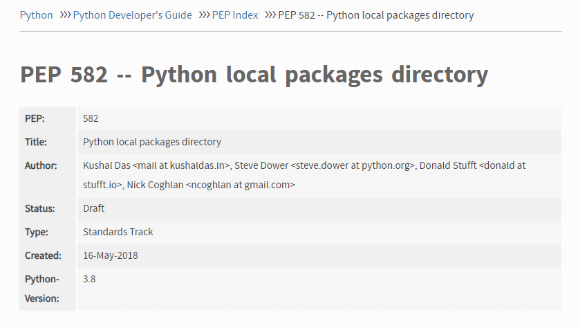
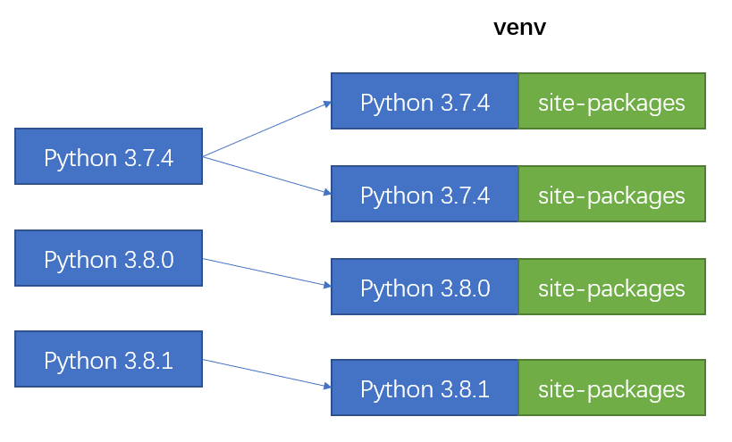
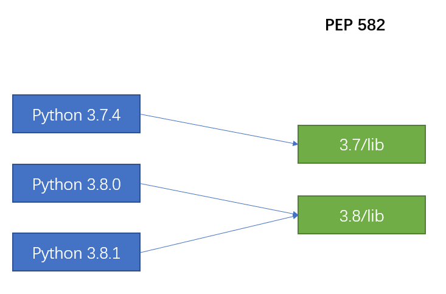
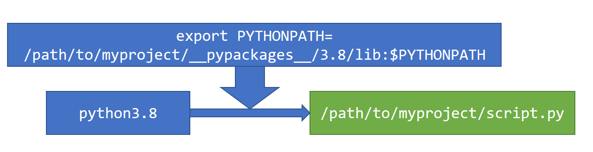
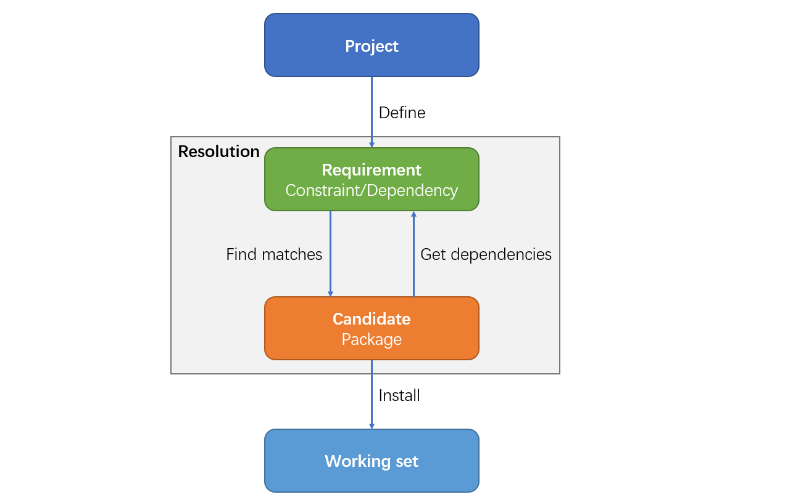

class: center, middle

# PEP 582 包管理器

<h3 class="fa fa-github"> frostming</h3>

---

# 我是谁

- Python Packaging Authority(PyPA) 成员
- Pipenv 维护者之一
- @Tencent

---

class: left, middle

# Agenda

1. PEP 582 简介
2. PDM - 一个支持 PEP 582 的包管理器
3. 从零开始手撸一个包管理器

---

# PEP 582 简介



---

# PEP 582 简介

文件结构

```bash
myproject
*├── __pypackages__
│   └── 3.8
│       └── lib
│           └── bottle
└── myscript.py
```

当执行 `python myproject/myscript.py` 时, `myproject/__pypackages__/3.8/lib` 会自动加载到 `sys.path` 中。

---

# 与虚拟环境的比较



每个虚拟环境都绑定了一个 Python 解释器，当这个解释器对应的路径被删除、替换，则此虚拟变为不可用。

**灵魂拷问：我们真的需要在一个隔离的环境中放一个解释器吗？**

---

# 与虚拟环境的比较



- 把解释器从环境中解放出来
- 一个隔离环境应该仅仅是依赖包的隔离，只要是同版本的 Python 都能使用

---

# 我为什么做了 PDM?


- 抛弃虚拟环境
- 更好的依赖解析
- 自己做主

---

# PDM 是如何实现 PEP 582 的



```python
import sys
print(sys.path)
[
    '',
    '/path/to/myproject/__pypackages__/3.8/lib',
    '/Users/fming/Library/PythonUp/versions/3.8/lib/python38.zip',
    '/Users/fming/Library/PythonUp/versions/3.8/lib/python3.8',
    '/Users/fming/Library/PythonUp/versions/3.8/lib/python3.8/lib-dynload',
*   '/Users/fming/Library/PythonUp/versions/3.8/lib/python3.8/site-packages',
*   '/Users/fming/.local/lib/python3.8/site-packages',
]
```

---

## 去除 `site-packages`

```bash
myproject
├── __pypackages__
│   └── 3.8
│       └── lib
*│           ├── site.py
│           └── ...
└── myscript.py
```

```python
# site.py
for item in sys.path:
    if "site-packages" in item:
        continue
    new_path.append(item)
sys.path[:] = new_path
```

`site.py`将在 Python 启动时自动执行，`site.py`必须在搜索路径中优先于`lib/site.py`.

---

class: middle

```python
import sys
print(sys.path)
[
    '',
    '/path/to/myproject/__pypackages__/3.8/lib',
    '/Users/fming/Library/PythonUp/versions/3.8/lib/python38.zip',
    '/Users/fming/Library/PythonUp/versions/3.8/lib/python3.8',
    '/Users/fming/Library/PythonUp/versions/3.8/lib/python3.8/lib-dynload',
]
```

---

class: middle, center

# Demo Time!

---

# 从零开始手撸包管理器

包管理器中需要用到的 model



---

# 问答时间

.float-left[


本 Slides 地址: [https://slides.fming.dev/pep582/](https://slides.fming.dev/pep582/)
]

<i class="fa fa-2x fa-github"></i> Live coding 仓库地址: [https://git.io/JfCSV](https://git.io/JfCSV)

[<i class="fa fa-2x fa-twitter"></i> @frostming90](https://twitter.com/frostming90)
