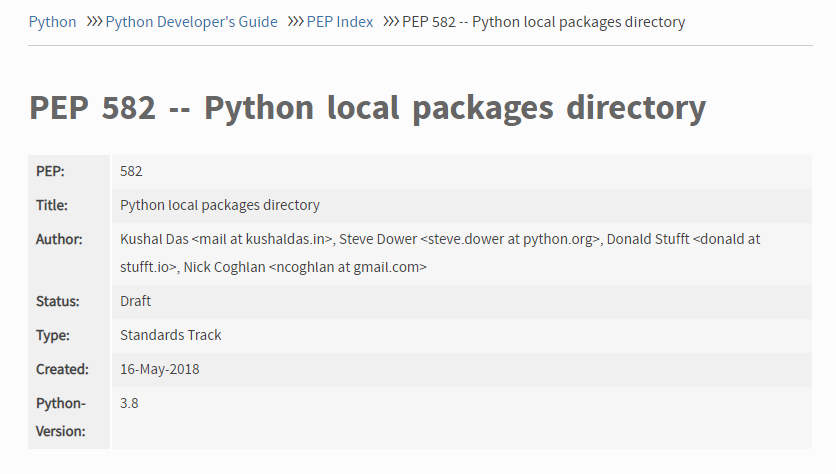
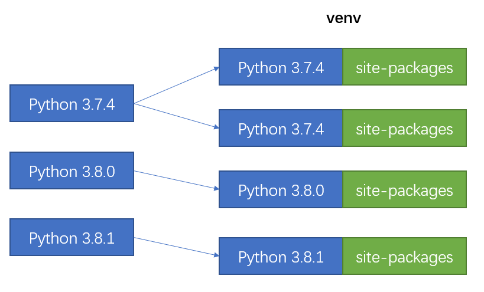
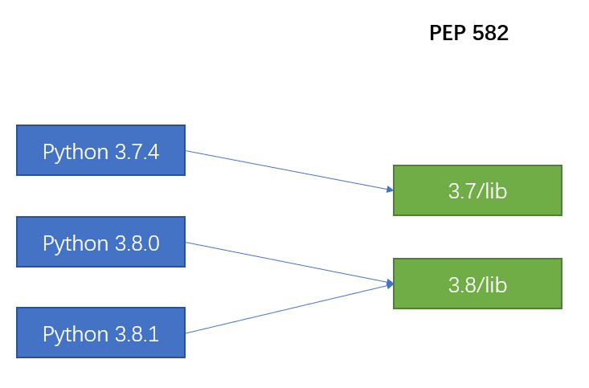

class: center, middle

# PEP 582 Package Manager

<h3 class="fa fa-github"> frostming</h3>

---
class: left, middle

# Agenda

1. Introduction to PEP 582
2. PDM - A modern package manager supporting PEP 582
3. Build a Python package manager scratch

---

# Introduction to PEP 582



---

# Introduction to PEP 582

Folder structure

```
myproject
*├── __pypackages__
│   └── 3.8
│       └── lib
│           └── bottle
└── myscript.py
```

When executing `python myproject/myscript.py`, `myproject/__pypackages__/3.8/lib` will be loaded as library root.

---
# Difference from venv



A venv is bound with a Python interpreter. When the original interpreter is gone, the venv becomes stale.

---
# Difference from venv



Decoupled the isolated environments(packages directory) with Python interpreter.

**Do we really need a Python interpreter inside isolated environment?**
